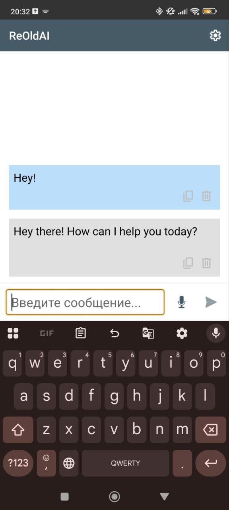
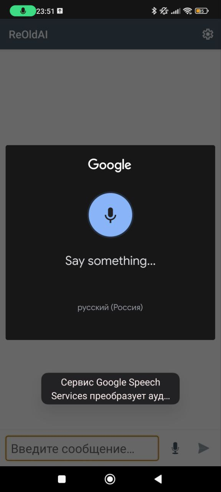

<div align="center">
  <a href="https://github.com/YMP-CO/ReOldAI">
    
  </a>
</div>
<center></center>
<h3 align="center">ReOldAI</h3>
<center><h5>Unofficial Gemini client for Android 2.3+<h5></center>
<center><h6>"Gemini" and other related trademarks are trademarks of Google. Google is not associated with ReOldAi or YMP Yuri.<h6></center>
<div align="center">
  <a href="https://ymp-co.github.io">Website</a> • 
  <a href="https://boosty.to/gachic_the_geek">Boosty</a> • 
  <a href="https://www.youtube.com/@YMP_Yuri">YouTube: YMP Yuri</a>
</div>
<div align="center">
  <h3 href="https://ymp-co.github.io">⬇️ DOWNLOAD</h3>
  <a href="https://github.com/YMP-CO/ReOldAi/releases">Download on Github Releases</a>
</div>

## Table of Contents

1.  [About the Project](#about-the-project)
    
2.  [Technologies](#technologies)
    
3.  [Installation](#installation)
    
    -   [Requirements](#requirements)
        
    -   [Download](#download)
        
4.  [Usage](#usage)
    
5.  [Screenshots](#screenshots)
    
6.  [Compatibility Table](#compatibility-table)
    
7.  [Table Explanation](#table-explanation)
    
8.  [Voice Input](#voice-input)
    
9.  [How to Get a Gemini API Key](#how-to-get-a-gemini-api-key)
    
10.  [`build.gradle` Configuration](#build-gradle-configuration)
    
11.  [Roadmap](#roadmap)
    
12.  [Contacts](#contacts)
    
13.  [License](#license)
14.  Other Information

----------

## About the Project

**ReOldAi** is a lightweight and minimalistic application that allows interaction with Google AI's Gemini model on older Android devices (starting from version 2.2*, API 8).

Its minimal interface and lack of unnecessary dependencies allow it to run even on weak and outdated smartphones or tablets.
<h5> * - Be sure to check the compatibility table! </h5>
----------

## Brief App Information

-   Language: Java
    
-   UI: Android Support Library (AppCompat v7, Support v4)
    
-   Uses Conscrypt library (SSL/TLS) for new certificate support
    
-   JSON Serialization: Google GSON
    
-   Icons: Material Icons (Google)
    
-   Languages: Russian and English

-   Neural Network Used: Gemini API (Google AI Studio)
    

----------

## Installation

### Requirements

-   Device with Android 2.2 or higher (minimum API 8 support)
    
-   Stable internet connection for Gemini API operation
    
-   Gemini API key (see section below)
    

### Download

 - Link to Github releases: https://github.com/YMP-CO/ReOldAi/releases
----------

## Usage

1.  Launch ReOldAi
    
2.  Enter your Gemini API key in the window or settings
    
3.  Start a dialogue in the text chat
It's simple!
----------

## Screenshots

<div style="display: flex; flex-wrap: wrap; justify-content: center; gap: 15px;">
  
  
  
  
</div>

----------

## Compatibility Table

| Feature                 | Android 2.1< | Android 2.2 | Android 2.3 | Android 3.0–3.2 | Android 4.0 | Android 4.1 | Android 4.2> |
|-------------------------|:-----------:|:-----------:|:-----------:|:---------------:|:-----------:|:-----------:|:------------:|
| Result          |     🟥 Even basic libraries are not compatible    |     🟧 App launches, but Conscrypt doesn't work due to library incompatibility      |     🟩     |       🟩       |     🟩      |     🟩     |     🟩     |
| App Launch       |     🟥     |     🟩      |     🟩      |       🟩        |     🟩      |     🟩      |     🟩       |
| Stability            |     🟥     |     🟨 (Libraries compatible only with Android 2.3)      |     🟩      |       🟩        |     🟩      |     🟩      |     🟩       |
| Neural Network Operation        |     🟥     |     🟥 (Certificate error)      |     🟩     |       🟩        |     🟩      |     🟩      |     🟩       |
| Voice Input          |     🟥     |     🟥      |     🟥      |       🟥        |     🟧 (Offline Google speech recognition support can be enabled)      |     N/A     |     🟩 (Requires Google app (Velvet.apk))      |
| Message Copying   |     🟥     |     🟩      |     🟩      |       🟩        |     🟩      |     🟩      |     🟩       |


- 🟩 Full support
- 🟧 Partial support (works, but with limitations)
- 🟨 Potential crashes (limited stability)
- 🟥 Not supported
- N/A Not tested
    

----------

## Table Explanation

-   **Result**: overall information on how the application functions.
    
-   **App Launch**: whether the application starts correctly.
    
-   **Stability**: number of critical crashes and freezes.
    
-   **Neural Network Operation**: successful requests and receiving responses from Gemini.
    
-   **Voice Input**: usage of Android Recognizer Intent (more details below).
    
-   **Message Copying**: availability of the context menu and clipboard.
----------

## Voice Input

```java
private void startVoiceInput() {
    Intent intent = new Intent(RecognizerIntent.ACTION_RECOGNIZE_SPEECH);
    intent.putExtra(RecognizerIntent.EXTRA_LANGUAGE_MODEL, RecognizerIntent.LANGUAGE_MODEL_FREE_FORM);
    intent.putExtra(RecognizerIntent.EXTRA_LANGUAGE, Locale.getDefault());
    intent.putExtra(RecognizerIntent.EXTRA_PROMPT, "Say something...");

    try {
        startActivityForResult(intent, SPEECH_INPUT_REQUEST_CODE);
    } catch (ActivityNotFoundException e) {
        Toast.makeText(getApplicationContext(),
                "Your device does not support voice input.",
                Toast.LENGTH_SHORT).show();
    }
}

```

>This feature requires Google app version 3.0 or higher (not verified)

----------

## How to Get a Gemini API Key

1.  Go to [Google AI Studio](https://aistudio.google.com) and sign in with your Google account.
    
2.  Click the **"Get API KEY"** button at the top.
    
3.  Then, click **"Create API key"**.

4.  Done!
    

----------

## `build.gradle` Configuration

```groovy
plugins {
    alias(libs.plugins.android.application)
}

android {
    namespace 'com.ymp.reold.ai'
    compileSdk 34

    defaultConfig {
        applicationId "com.ymp.reold.ai"
        minSdk 8
        targetSdk 34
        versionCode 1
        versionName "1.0"

        testInstrumentationRunner "androidx.test.runner.AndroidJUnitRunner"
    }

    buildTypes {
        release {
            minifyEnabled false
            proguardFiles getDefaultProguardFile('proguard-android-optimize.txt'), 'proguard-rules.pro'
        }
    }
    compileOptions {
        sourceCompatibility JavaVersion.VERSION_11
        targetCompatibility JavaVersion.VERSION_11
    }
}

dependencies {
    implementation 'com.android.support:appcompat-v7:23.0.0'
    implementation 'com.android.support:support-v4:23.0.0'

    implementation 'org.conscrypt:conscrypt-android:2.5.2'
    implementation 'com.google.code.gson:gson:2.8.6'

    testImplementation 'junit:junit:4.12'
    androidTestImplementation 'com.android.support.test:runner:0.5'
    androidTestImplementation 'com.android.support.test.espresso:espresso-core:2.2.2'
}

```

----------

## Roadmap

-   Finish Russian interface translation
    
-   Add support for additional Gemini models
    
-   Expand neural network parameter settings (top-p, temperature)
    
-   Implement dark theme
    
-   Oh, how about I add support for Android 1.0+ (in my dreams)   

----------

## Contacts

-   YouTube: [YMP Yuri](https://www.youtube.com/@YMP_Yuri)
    
-   Boosty: [gachic_the_geek](https://boosty.to/gachic_the_geek)
    
-   Website: [ymp-co.github.io](https://ymp-co.github.io)
    
----------

## License

Distributed under the CC-BY 4.0 License.

----------

## Other Information
Two methods were used to enable message copying:
```java
private void copyTextToClipboard(String text) {  
    // For Android API 11 (Honeycomb) and higher  
  if (Build.VERSION.SDK_INT >= Build.VERSION_CODES.HONEYCOMB) {  
        ClipboardManager clipboard = (ClipboardManager) getContext().getSystemService(Context.CLIPBOARD_SERVICE);  
        ClipData clip = ClipData.newPlainText("AI Chat Message", text);  
        clipboard.setPrimaryClip(clip);  
    }  
    // For Android API 8, 9, 10 (Froyo, Gingerbread ->)  
  else {  
        //android.text.ClipboardManager  
  android.text.ClipboardManager clipboard =  
                (android.text.ClipboardManager) getContext().getSystemService(Context.CLIPBOARD_SERVICE);  
        clipboard.setText(text);  
    }  
    Toast.makeText(getContext(), "Copied text.", Toast.LENGTH_SHORT).show();  
}
```
**Also, I want to warn everyone that I am only 16 years old. I am not a professional programmer; I used neural networks for development, etc. Please don't judge too harshly - the project is in beta testing!**
